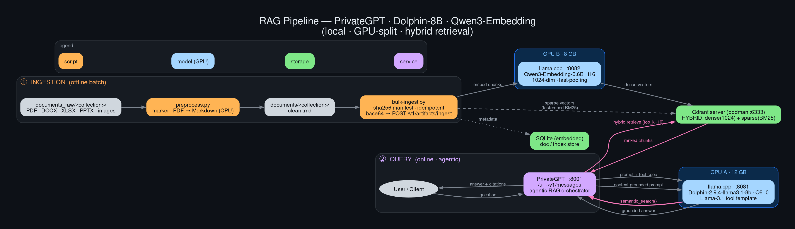
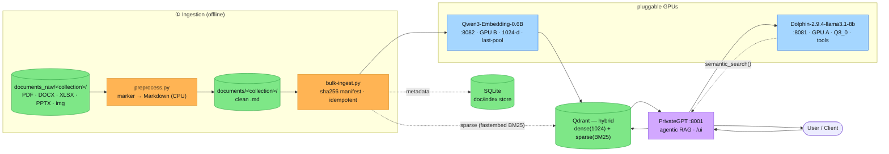

# RAG-Pipeline-Example

A complete, self-hosted **Retrieval-Augmented Generation** pipeline built on
[`zylon-ai/private-gpt`](https://github.com/zylon-ai/private-gpt), a local
[`llama.cpp`](https://github.com/ggml-org/llama.cpp) LLM, a local embedding
model, an embedded [Qdrant](https://qdrant.tech/) vector store with **hybrid
(dense + sparse) retrieval**, and [`marker`](https://github.com/datalab-to/marker)
for PDF → Markdown preprocessing.

It runs entirely on one box with **two GPUs**, splitting the generation model and
the embedding model across the cards so they never contend.

> This repo is **design documentation** for the pipeline — architecture, a
> colour-coded graph, an exhaustively enumerated configuration reference, the
> design decisions (and the dead-ends), and an operations runbook. Host names and
> IP addresses are intentionally omitted; GPUs are referred to as **GPU A** (12 GB)
> and **GPU B** (8 GB).

---

## The pipeline at a glance



*(Source: [`docs/pipeline.dot`](docs/pipeline.dot) · SVG: [`assets/pipeline.svg`](assets/pipeline.svg))*



---

## Components

| Layer | Software | Model | Where | Port |
|---|---|---|---|---|
| Generation LLM | llama.cpp `llama-server` | **Dolphin-2.9.4-llama3.1-8b** Q8_0 | GPU A (12 GB) | `8081` |
| Embeddings | llama.cpp `llama-server` | **Qwen3-Embedding-0.6B** f16 (1024-dim) | GPU B (8 GB) | `8082` |
| RAG orchestrator | PrivateGPT (`private-gpt`, `uv` tool) | — (middleware) | CPU/RAM | `8001` |
| Vector store | Qdrant **server** (podman) + fastembed BM25 | — | disk/RAM | `6333` |
| Doc/index store | SQLite (embedded) | — | disk | — |
| PDF preprocessing | marker (`marker-pdf`, dedicated venv) | Surya models | CPU | — |

Everything is OpenAI/Anthropic-API-compatible and wired together with plain HTTP.
PrivateGPT itself runs **standalone** (embedded SQLite); the only companion
service is a **Qdrant server** (a `podman` container). No Postgres/Redis/RabbitMQ.

---

## Two data paths

**① Ingestion (offline).** Drop source files in `documents_raw/<collection>/` →
`preprocess.py` converts PDFs to clean Markdown with `marker` → `bulk-ingest.py`
base64-encodes each file and POSTs it to PrivateGPT, which chunks it, embeds the
chunks with Qwen3-Embedding (dense) **and** fastembed BM25 (sparse), and stores
both vector sets in Qdrant. One PrivateGPT *collection* per top-level subfolder.

**② Query (online, agentic).** A question goes to PrivateGPT → it prompts the
Dolphin LLM with a tool spec → the LLM **calls the `semantic_search` tool** →
PrivateGPT runs a **hybrid** (dense + sparse) retrieval against Qdrant → the
top-k chunks are fed back to the LLM → it returns a **grounded answer with
citations**.

---

## Quickstart (operator)

The full, copy-pasteable runbook is in **[docs/operations.md](docs/operations.md)**.
The short version:

```bash
# 1. ingest some documents
cp mydocs/*.pdf  ~/pgpt/documents_raw/handbook/
~/marker-venv/bin/python ~/pgpt/preprocess.py     # PDF → Markdown
python3 ~/pgpt/bulk-ingest.py                      # chunk + embed + store

# 2. ask (UI)
xdg-open http://localhost:8001/ui

# 2'. ask (API)
curl -s http://localhost:8001/v1/messages -H 'Content-Type: application/json' -d '{
  "model":"dolphin-8b","max_tokens":300,
  "messages":[{"role":"user","content":"<your question>"}],
  "tools":[{"name":"semantic_search","type":"semantic_search_v1",
            "context":[{"type":"ingested_artifact","context_filter":{"collection":"handbook"}}],
            "inputSchema":{"type":"object","properties":{"query":{"type":"string"}},"required":["query"]}}]
}'
```

---

## Documentation

| Doc | What's in it |
|---|---|
| **[docs/architecture.md](docs/architecture.md)** | Components, data flow, GPU/VRAM allocation, request lifecycle |
| **[docs/configuration-reference.md](docs/configuration-reference.md)** | **Every** env var, CLI flag, port, path, and model parameter — exhaustively |
| **[docs/design-decisions.md](docs/design-decisions.md)** | Why each choice was made, the trade-offs, and the dead-ends |
| **[docs/operations.md](docs/operations.md)** | Install, start/stop, rollback, ingestion workflow, troubleshooting |
| **[docs/pipeline.dot](docs/pipeline.dot)** | Graphviz source for the diagram |

---

## Known limitations

- **No reranker.** PrivateGPT v2 has no cross-encoder rerank stage; precision is
  managed with a lower `top_k` and hybrid retrieval instead. See design-decisions.
- **8B tool-calling is chatty.** The model sometimes issues several
  `semantic_search` calls (occasionally with a bad argument) before grounding —
  it works, but a larger model would be crisper.
- **Speculative decoding gives no speedup** with the available draft and is
  disabled (kept toggleable). See design-decisions.
- **Per-file ingest cap ≈ 25 MiB** (base64 path). Larger files need the limit
  raised or local-ingestion mode.

---

## License

MIT — see [LICENSE](LICENSE).
